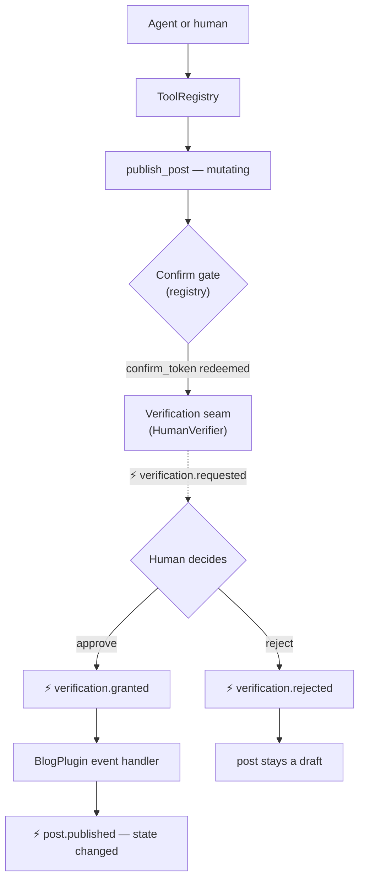

<p align="center">
  <a href="https://github.com/getmilpa">
    <picture>
      <source media="(prefers-color-scheme: dark)" srcset="https://raw.githubusercontent.com/getmilpa/core/main/art/lockup/milpa-lockup-v-color-dark.svg">
      
    </picture>
  </a>
</p>

# Milpa Example: Agent-Ready Blog

> The Milpa loop, live: `plugin → capability → tool → verification → event → result` —
> as a tiny agent-ready blog you can run in two commands.

[](https://github.com/getmilpa/example-agent-ready-blog/actions/workflows/ci.yml)
[](https://packagist.org/packages/milpa/example-agent-ready-blog)
[](https://www.php.net/)
[](LICENSE)

**This repo doesn't teach you how to build a blog. It teaches you how to make a mutation
agent-ready without losing human control.**

Most examples let agents mutate state directly. This one does not. Every mutation enters
through a declared tool, passes through a confirmation/verification seam, and only becomes
application state through an event. The blog is just the smallest honest thing worth mutating.



Prefer a guided tour? Read [`docs/walkthrough.md`](docs/walkthrough.md) — eight files, in
the order that makes the loop click.

## Quickstart

```bash
composer create-project milpa/example-agent-ready-blog blog
cd blog
php bin/blog.php
```

You'll be asked to approve or reject a publish request interactively. Here's a real run
(`a` typed at the prompt):

```
milpa · example-agent-ready-blog — the loop, live
plugin → capability → tool → verification → event → result

✔ Capability graph: StoragePlugin provides PostStorage → BlogPlugin requires it
✔ 3 plugins booted · tools: create_post, human_verify, list_posts, publish_post

→ create_post("Hello Milpa") … draft #1 created (not mutating-gated: no friction)
→ publish_post(#1) … INTERCEPTED by the registry confirm gate → confirm_token 867c9ca7…
  ⚡ verification.requested
→ token redeemed … the tool ran and asked the VERIFICATION seam (status: pending_verification)
? An agent wants to publish post #1 — [a]pprove / [r]eject: a
  ⚡ verification.granted
  ⚡ post.published (id 1)
✔ post #1 is now PUBLISHED — the result arrived via event, handled by BlogPlugin

See it: php -S localhost:8080 -t public   →   http://localhost:8080
```

Now look at it:

```bash
php -S localhost:8080 -t public
```

Prefer non-interactive? `php bin/blog.php --auto-approve` and `php bin/blog.php --reject`
drive both paths without a prompt — that's exactly what this repo's own CI runs as its
smoke test.

## The loop, stage by stage

Every stage below is a real contract from a published package, not an abstraction invented
for this example.

| Stage | What runs | Published contract |
|---|---|---|
| **plugin** | `Kernel::boot()` instantiates `StoragePlugin`, `BlogPlugin`, `AgentToolsPlugin` | `Milpa\Interfaces\Plugin\PluginInterface` + `#[Milpa\Attributes\PluginMetadata]` (`milpa/core`) |
| **capability** | `CapabilityGraph::check()` reads each plugin's `#[PluginMetadata]`, builds the VOs, and fails *before* boot if a `requires` has no `provides` | `Milpa\ValueObjects\Capability\{CapabilityProvision,CapabilityRequirement}` (`milpa/core`) |
| **tool** | `AgentToolsPlugin::registerTools()` scans `BlogTools`'s three `#[Tool]` methods into the registry | `Milpa\ToolRuntime\{Attributes\Tool,Attributes\Param,ToolScanner,ToolRegistry}` + `Milpa\Interfaces\Tooling\ToolProviderInterface` (`milpa/tool-runtime` on `milpa/core`) |
| **verification** | `publish_post` asks `HumanVerifier::verify()`; a human approves or rejects at the terminal prompt | `Milpa\Interfaces\Verification\VerifierInterface` (`milpa/core`) + `Milpa\ToolRuntime\Verification\HumanVerifier` (`milpa/tool-runtime`) |
| **event** | Every step above fires through one shared dispatcher — `verification.requested` / `verification.granted` / `verification.rejected` / `post.published` — printed live by name | `Milpa\Interfaces\Event\MilpaEventDispatcherInterface` (`milpa/core`), implemented here by `App\EventDispatcher` |
| **result** | `BlogPlugin`'s `verification.granted` handler flips the post to `published` and dispatches `post.published` — the result arrives *via event*, not a return value | `src/Plugins/BlogPlugin/BlogPlugin.php` (this repo) |

## What an agent sees

The tools are transport-agnostic: what follows is the registry's own
`getToolSummaries()` output — the exact catalog an MCP host (or any other transport)
would list. This is real output, not documentation prose:

```json
[
  {
    "name": "publish_post",
    "description": "Publish a draft post (requires human verification)",
    "inputSchema": {
      "type": "object",
      "properties": { "id": { "type": "integer", "description": "Post id" } },
      "required": ["id"]
    }
  },
  {
    "name": "create_post",
    "description": "Create a draft post",
    "inputSchema": {
      "type": "object",
      "properties": {
        "title": { "type": "string", "description": "Post title" },
        "body":  { "type": "string", "description": "Post body" }
      },
      "required": ["title", "body"]
    }
  }
]
```

(`list_posts` and `human_verify` are also listed — run
`$kernel->registry()->getToolSummaries()` to see the full catalog.)

From the agent's side, publishing is a two-call choreography — it never mutates on the
first try:

1. `publish_post(id: 1)` → the registry intercepts (the tool is `mutating`) and returns a
   `confirm_token` instead of running the tool.
2. `publish_post(id: 1, confirm_token: …)` → the tool runs, asks the verification seam,
   and returns `pending_verification` with a `request_id`.
3. The actual state change arrives **by event** (`verification.granted` →
   `post.published`), never as a return value the agent can force.

**About `human_verify`** (the name comes from `milpa/tool-runtime`): it *requests or
resolves* a verification — it does not make anyone human. Its `principal` argument is an
opaque string, and the schema itself says who may resolve is **the host's problem**: the
runtime trusts the host to authenticate principals. In this example the only resolution
channel wired is the terminal prompt — an agent calling `human_verify` with
`decision: grant` would still be an unauthenticated principal unless *you* build the
policy layer that says otherwise. That is the seam doing its job: the framework hands you
the gate; guarding it is explicitly your half of the contract.

## The same tools, over MCP — point your agent at it

`bin/mcp-server.php` puts this exact registry — the same four tools, the same
confirm-token gate, the same verification seam — behind a standard MCP stdio transport
(`milpa/mcp-server`: JSON-RPC 2.0 over stdin/stdout, one message per line). Point any
MCP-compatible agent host at it with the `mcpServers` shape most hosts share:

```json
{
  "mcpServers": {
    "agent-ready-blog": {
      "command": "php",
      "args": ["/absolute/path/to/blog/bin/mcp-server.php"]
    }
  }
}
```

Or run it directly to watch the wire, no host required:

```bash
php bin/mcp-server.php
```

It logs its own status to STDERR — never STDOUT, which is protocol-only — then reads one
JSON-RPC 2.0 request per line from STDIN: `initialize`, `notifications/initialized`
(silently — no response, per the JSON-RPC spec), `tools/list`, `tools/call`. Same
choreography as "What an agent sees" above, just over a socket instead of an in-process
call.

**Verification still goes through your human.** This transport carries no auth — process-
level trust, the same posture as any local stdio MCP server (`milpa/mcp-server` exposes
`Auth\TokenValidatorInterface` as the seam to HTTP + real auth, unused here). What doesn't
change: `publish_post` still stops at `pending_verification` and waits for
`human_verify(subject, decision: "grant"|"reject", principal, request_id)`. When an agent
hits that gate over MCP, it asks **its own human**, in its own chat — the same rule as the
terminal demo, just relocated to wherever the agent's human actually is.

## What implements what

Three of the four published packages define the seams below; this repo implements the
smallest possible host around them — ~940 lines of application code, of which ~440
implement every framework seam. On purpose, so you can read every line. (The fourth,
`milpa/mcp-server`, is consumed directly by `bin/mcp-server.php` — there's no local
interface to implement, just a transport to wrap around the same registry.)

| Unit | Lines | Implements | Notes |
|---|---|---|---|
| `App\Container` | 146 | `Milpa\Interfaces\Di\DIContainerInterface` (`milpa/core`) | Explicit `registerService()` plus honest constructor autowiring — exactly what the published docblocks promise, no more. |
| `App\EventDispatcher` | 82 | `Milpa\Interfaces\Event\MilpaEventDispatcherInterface` (`milpa/core`) | Priority ordering, the documented wildcard grammar (`*` matches exactly one dot-segment), and handler error isolation. |
| `App\CapabilityGraph` | 52 | — (consumes core's `CapabilityProvision`/`CapabilityRequirement` VOs) | The "A provides / B requires" edge of the loop, checked before any plugin boots. |
| `App\Http\Router` | 71 | `Milpa\Http\Routing\RouterInterface` (`milpa/http`) | Exact segments plus single-segment `{placeholder}`s; never throws, never returns null — `RouteResult` carries the outcome. |
| `App\Kernel` | 89 | — (orchestrates the four above) | Container → dispatcher → capability check → ordered plugin boot → tool registry wiring. A miniature of a real Milpa host. |

You can implement the seams in an afternoon — this repo is the proof.

## What this example is NOT

- **Not production.** Storage is a plain JSON file (`var/posts.json`), there's no auth, and
  `App\Container` has no compiled/cached resolution — it's a from-scratch DI container that
  happens to satisfy the published interface.
- **Not a template to fork for a real blog.** It's a template for understanding the loop.
- **Mutations enter via tools, not HTTP** — that's the point. The web view
  (`php -S localhost:8080 -t public`) is read-only by design: publishing a post always goes
  through `create_post` → `publish_post` → human verification, whether the caller is a human
  running `bin/blog.php` or an agent calling the same tools over MCP (`bin/mcp-server.php`) —
  the tools are transport-agnostic, and both entry points prove it.

## The family

This example consumes four published Milpa packages, unmodified, from Packagist:

- [`milpa/core`](https://packagist.org/packages/milpa/core) — the contracts core ·
  [API reference](https://getmilpa.github.io/core/)
- [`milpa/http`](https://packagist.org/packages/milpa/http) — PSR-15-native routing
  contracts · [API reference](https://getmilpa.github.io/http/)
- [`milpa/tool-runtime`](https://packagist.org/packages/milpa/tool-runtime) — the
  agent-tool-execution engine · [API reference](https://getmilpa.github.io/tool-runtime/)
- [`milpa/mcp-server`](https://packagist.org/packages/milpa/mcp-server) — the MCP
  transport core (JSON-RPC 2.0 over the tool registry) · [API reference](https://getmilpa.github.io/mcp-server/)

## Contributing

Contributions are welcome — see [CONTRIBUTING.md](CONTRIBUTING.md). Please report security
issues via [SECURITY.md](SECURITY.md), and note that this project follows a
[Code of Conduct](CODE_OF_CONDUCT.md).

## License

[Apache-2.0](LICENSE) © TeamX Agency.

---

Milpa is designed, built, and maintained by **[TeamX Agency](https://teamx.agency/?utm_source=github&utm_medium=readme&utm_campaign=milpa&utm_content=example-agent-ready-blog)**.
