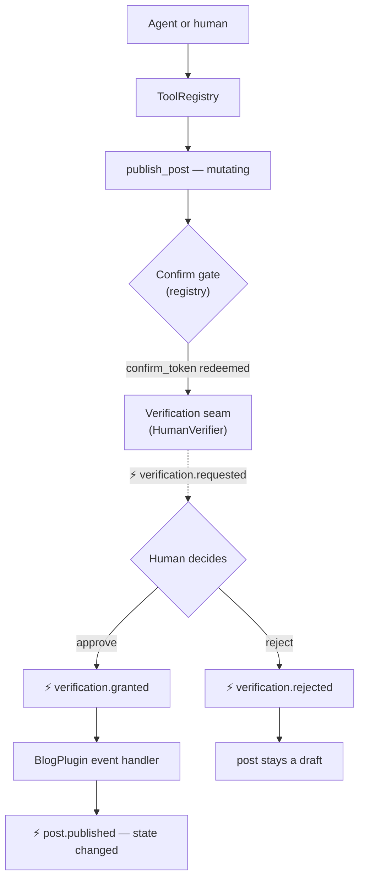

<p align="center">
  <a href="https://github.com/getmilpa">
    <picture>
      <source media="(prefers-color-scheme: dark)" srcset="https://raw.githubusercontent.com/getmilpa/core/main/art/lockup/milpa-lockup-v-color-dark.svg">
      
    </picture>
  </a>
</p>

# Milpa Example: Agent-Ready Blog

> The Milpa loop, live: `plugin → capability → tool → verification → event → result` —
> as a tiny agent-ready blog you can run in two commands.

[](https://github.com/getmilpa/example-agent-ready-blog/actions/workflows/ci.yml)
[](https://packagist.org/packages/milpa/example-agent-ready-blog)
[](https://www.php.net/)
[](LICENSE)

**This repo doesn't teach you how to build a blog. It teaches you how to make a mutation
agent-ready without losing human control.**

Most examples let agents mutate state directly. This one does not. Every mutation enters
through a declared tool, passes through a confirmation/verification seam, and only becomes
application state through an event. The blog is just the smallest honest thing worth mutating.



Prefer a guided tour? Read [`docs/walkthrough.md`](docs/walkthrough.md) — eight files, in
the order that makes the loop click.

## Quickstart

```bash
composer create-project milpa/example-agent-ready-blog blog
cd blog
php bin/blog.php
```

You'll be asked to approve or reject a publish request interactively. Here's a real run
(`a` typed at the prompt):

```
milpa · example-agent-ready-blog — the loop, live
plugin → capability → tool → verification → event → result

✔ Capability graph: StoragePlugin provides PostStorage → BlogPlugin requires it
✔ 3 plugins booted · tools: create_post, list_posts, publish_post, request_verification, resolve_verification

→ create_post("Hello Milpa") … draft #1 created (not mutating-gated: no friction)
→ publish_post(#1) … INTERCEPTED by the registry confirm gate → confirm_token 867c9ca7…
  ⚡ verification.requested
→ token redeemed … the tool ran and asked the VERIFICATION seam (status: pending_verification)
? An agent wants to publish post #1 — [a]pprove / [r]eject: a
  ⚡ verification.granted
  ⚡ post.published (id 1)
✔ post #1 is now PUBLISHED — the result arrived via event, handled by BlogPlugin

See it: php -S localhost:8080 -t public   →   http://localhost:8080
```

Now look at it:

```bash
php -S localhost:8080 -t public
```

Prefer non-interactive? `php bin/blog.php --auto-approve` and `php bin/blog.php --reject`
drive both paths without a prompt — that's exactly what this repo's own CI runs as its
smoke test.

## The loop, stage by stage

Every stage below is a real contract from a published package, not an abstraction invented
for this example.

| Stage | What runs | Published contract |
|---|---|---|
| **plugin** | `Kernel::boot()` instantiates `StoragePlugin`, `BlogPlugin`, `AgentToolsPlugin` | `Milpa\Interfaces\Plugin\PluginInterface` + `#[Milpa\Attributes\PluginMetadata]` (`milpa/core`) |
| **capability** | `Kernel::boot()` gates the plugin graph through the architecture resolver *before* anything boots: plugins boot in the report's `loadOrder[]`, and a `requires` with no `provides` throws `ArchitectureBlockedException` with a learnable message | `#[Milpa\Attributes\PluginMetadata]` capability records (`milpa/core`) resolved by `milpa/resolver` via `milpa/runtime` |
| **tool** | `AgentToolsPlugin::registerTools()` scans `BlogTools`'s three `#[Tool]` methods into the registry | `Milpa\ToolRuntime\{Attributes\Tool,Attributes\Param,ToolScanner,ToolRegistry}` + `Milpa\Interfaces\Tooling\ToolProviderInterface` (`milpa/tool-runtime` on `milpa/core`) |
| **verification** | `publish_post` asks `HumanVerifier::verify()`; a human approves or rejects at the terminal prompt | `Milpa\Interfaces\Verification\VerifierInterface` (`milpa/core`) + `Milpa\ToolRuntime\Verification\HumanVerifier` (`milpa/tool-runtime`) |
| **event** | Every step above fires through one shared dispatcher — `verification.requested` / `verification.granted` / `verification.rejected` / `post.published` — printed live by name | `Milpa\Interfaces\Event\MilpaEventDispatcherInterface` (`milpa/core`), implemented by `milpa/events`' `EventDispatcher` |
| **result** | `BlogPlugin`'s `verification.granted` handler flips the post to `published` and dispatches `post.published` — the result arrives *via event*, not a return value | `src/Plugins/BlogPlugin/BlogPlugin.php` (this repo) |

## What an agent sees

The tools are transport-agnostic: what follows is the registry's own
`getToolSummaries()` output — the exact catalog an MCP host (or any other transport)
would list. This is real output, not documentation prose:

```json
[
  {
    "name": "publish_post",
    "description": "Publish a draft post (requires human verification)",
    "inputSchema": {
      "type": "object",
      "properties": { "id": { "type": "integer", "description": "Post id" } },
      "required": ["id"]
    }
  },
  {
    "name": "create_post",
    "description": "Create a draft post",
    "inputSchema": {
      "type": "object",
      "properties": {
        "title": { "type": "string", "description": "Post title" },
        "body":  { "type": "string", "description": "Post body" }
      },
      "required": ["title", "body"]
    }
  }
]
```

The full catalog has five tools, in two categories:

| Category | Tools | Purpose |
|---|---|---|
| **Application** | `create_post`, `list_posts`, `publish_post` | the blog's own operations |
| **Runtime / control** | `request_verification`, `resolve_verification` | the verification seam |

They are listed together because **MCP exposes tools, not architectural layers** — policy
decides which principals may call each one. (Run `$kernel->registry()->getToolSummaries()`
to see the whole list.)

From the agent's side, publishing is a two-call choreography — it never mutates on the
first try:

1. `publish_post(id: 1)` → the registry intercepts (the tool is `mutating`) and returns a
   `confirm_token` instead of running the tool.
2. `publish_post(id: 1, confirm_token: …)` → the tool runs, asks the verification seam,
   and returns `pending_verification` with a `request_id`.
3. The actual state change arrives **by event** (`verification.granted` →
   `post.published`), never as a return value the agent can force.

The two verification tools are split (`request_verification` opens, `resolve_verification`
closes) precisely so policy can treat them differently — the security boundary below spells
out what that means and what this demo deliberately leaves to you.

## The same tools, over MCP

`bin/mcp-server.php` puts this exact registry — the same five tools, the same confirm-token
gate, the same verification seam — behind a standard MCP stdio transport (`milpa/mcp-server`:
JSON-RPC 2.0 over stdin/stdout, one message per line).

It is not a second API. It is the same core, wrapped: `Kernel::boot()` and the registry are
unchanged; only the outer loop differs (stdin/stdout instead of a terminal prompt).

Point an **MCP-compatible host that supports local stdio servers** at it — Claude Desktop,
Cursor, Windsurf and similar share this `mcpServers` config shape:

```json
{
  "mcpServers": {
    "agent-ready-blog": {
      "command": "php",
      "args": ["/absolute/path/to/blog/bin/mcp-server.php"]
    }
  }
}
```

Or run it directly to watch the wire, no host required:

```bash
php bin/mcp-server.php
```

STDOUT is protocol-only; human-readable status goes to STDERR (a stray `echo` on STDOUT
corrupts the wire). `notifications/initialized` gets no response line, per the JSON-RPC spec.

### A minimal session

```
→ {"jsonrpc":"2.0","id":1,"method":"initialize","params":{}}
← {"jsonrpc":"2.0","id":1,"result":{"protocolVersion":"2025-06-18",...}}
→ {"jsonrpc":"2.0","method":"notifications/initialized"}            (no response line)
→ {"jsonrpc":"2.0","id":2,"method":"tools/list"}
← {"jsonrpc":"2.0","id":2,"result":{"tools":[ ...5 tools... ]}}
→ tools/call create_post {"title":"Hello","body":"..."}             → draft #1
→ tools/call publish_post {"id":1}                                  → confirm_token (intercepted)
→ tools/call publish_post {"id":1,"confirm_token":"…"}              → pending_verification, request_id
→ tools/call resolve_verification {"request_id":"…","decision":"grant","principal":"…"}
←   verification.granted → post.published (the state change arrives by event)
```

### Two gates, different jobs

Publishing crosses **two** independent gates — a common point of confusion, so be explicit:

| Gate | Protects | Asks |
|---|---|---|
| **Confirm gate** (registry) | tool *execution* | "Are you sure this mutating tool should run at all?" |
| **Verification seam** (`HumanVerifier`) | domain *state transition* | "Should this change become real application state?" |

The confirm gate is generic registry-level safety; the verification seam is where policy,
human, or business approval lives. A mutating tool crosses both.

### ⚠️ Security boundary of this MCP example

**This example demonstrates the verification *seam*, not a complete identity/auth model — and
that difference is load-bearing.**

Over local stdio MCP the transport carries no authentication: the **host is trusted** to
decide who may call each tool (process-level trust). `resolve_verification` is a tool like
any other on the wire — so **an agent with enough scope could resolve its own verification.**
That is not a hole in the idea; it is a responsibility boundary this demo deliberately leaves
to the host.

Two things keep that boundary honest rather than hand-waved:

- **The seam to prevent self-approval already exists.** `request_verification` and
  `resolve_verification` are separate tools precisely so policy can restrict *who* may resolve
  — tool-runtime's `resolveScopes` gates it by authenticated principal. This demo doesn't wire
  an auth policy; production **must**.
- **The audit trail already records who resolved it.** Every call emits `tool.executed`
  carrying its `channel` and `principal` — so even under process-trust the resolver is logged,
  not anonymous.

In production, therefore:

```
resolve_verification MUST be restricted to an authenticated principal / scopes.
Over local stdio the host decides who calls it. Over HTTP, wire milpa/mcp-server's
Auth\TokenValidatorInterface (unused here) to authenticate the principal first.
```

The framework hands you the gate; **guarding it is explicitly your half of the contract.**

## The process-loop — a post *as an event-sourced process*

The tool-loop above (`create_post` → confirm gate → verification → event) is one shape of control.
The `src/Orchestrator/` layer shows the next one: the same publish becomes a **process** that a post
walks through — `draft → review_gate[human] → published` — driven by three MCP tools instead of one
verification call:

- `process_instantiate("publish_post", {post_id})` — starts the process; it auto-advances to the
  human gate and stops.
- `process_list_pending_approvals(assignee)` — the approver's inbox; each pending decision carries a
  **decision artifact** (a `milpa/live` component whose options map 1:1 to the gate's transitions —
  what you can click is exactly what the process can do).
- `process_submit_decision(instance_id, gate_id, "grant"|"reject", principal)` — resolves the gate;
  `grant` advances to `published`, `reject` returns to `draft`. Self-approval is refused.

Watch it run:

```bash
php bin/process.php --auto-approve   # instantiate → gate → grant → PUBLISHED
php bin/process.php --reject         # instantiate → gate → reject → back to review
```

The load-bearing property: **state is never stored, only derived.** Every step is an append-only
event in `var/events.jsonl`; the current state is a *projection* of that log. A brand-new store over
the same file reconstructs `published` independently — which is what makes the whole history
auditable and replayable (time-travel for free). The generic engine is `milpa/orchestrator` (the
process definition, reducer, auto-advancing runner, and human gate) over `milpa/event-store` (the
append-only log) — this example only `require`s them and supplies the **domain**: the `publish_post`
definition, a decision surface that renders a post, and a `process.terminal` listener that publishes
it. This layer *was* the greenhouse those two packages were extracted from; re-pointing it onto them
— and watching this same loop stay green — is the dogfood that proves the extraction.

## What implements what

Earlier versions of this repo implemented every framework seam inline (~440 lines: a container,
an event dispatcher, a capability graph, a router). Those are gone — since v0.6.0 the app boots on
**`milpa/runtime`**, which composes the published family (container + events + core's capability
check + http routing) into one `Kernel::boot()`. What was a hand-rolled kernel is now a ~40-line
bootstrap. The framework seams live in the packages where they belong; this repo implements only
the *domain* on top of them:

| Layer | What this repo implements | On top of |
|---|---|---|
| Boot | A thin bootstrap + a config-driven plugin list | `milpa/runtime` (`Kernel::boot`) |
| Domain | The blog plugins (Storage / Blog / AgentTools) + the 5 blog/verification tools | `milpa/core` contracts + `milpa/tool-runtime` |
| Transport | `bin/mcp-server.php` wraps the same registry over stdio | `milpa/mcp-server` |
| Process | The `publish_post` domain (`src/Orchestrator/`) — definition, decision surface, terminal listener | `milpa/orchestrator` + `milpa/event-store` (engine) over `milpa/workflow` + `milpa/live` + `milpa/events` |

The reduction is the point: the inline kernel retired with its tests green (they moved upstream into
the packages that now own that behavior). Read the ~40-line bootstrap and the domain — the framework
is no longer something you re-read here, it's something you `require`.

## The storage backend is one config line

Since `milpa/data` 0.2, `StoragePlugin` names **no backend**. It hands the app's `storage`
config block to `RepositoryFactory::fromConfig()` and registers whatever comes back behind the
same `RepositoryInterface` capability `BlogPlugin` requires. The block lives in
`Kernel::boot()`:

```php
$storage = [
    'driver' => 'sqlite',   // ⇄ 'file' ⇄ 'mysql' ⇄ 'memory' — the whole migration is this line
    'path' => $storageFile ?? $root . '/var/blog.db',
];
```

This example shipped on `'file'` (the whole collection in one JSON file, `var/posts.json`)
until 0.2 landed; today it ships on `'sqlite'` (a real database in one file, `var/blog.db`).
The switch touched zero plugin, tool, or test code — the same 36-test suite and the same
`php bin/blog.php --auto-approve` loop prove both backends. Flip the driver back and they
still do.

## What this example is NOT

- **Not production.** Storage is a single-file SQLite database (`var/blog.db`), there's no
  auth, and the DI container (`milpa/container`, via `milpa/runtime`) does no compiled/cached
  resolution here.
- **Not a template to fork for a real blog.** It's a template for understanding the loop.
- **Mutations enter via tools, not HTTP** — that's the point. The web view
  (`php -S localhost:8080 -t public`) is read-only by design: publishing a post always goes
  through `create_post` → `publish_post` → human verification, whether the caller is a human
  running `bin/blog.php` or an agent calling the same tools over MCP (`bin/mcp-server.php`) —
  the tools are transport-agnostic, and both entry points prove it.

## The family

This example consumes the published Milpa family, unmodified, from Packagist — riding the
current tree (`milpa/core ^0.6`, `milpa/runtime ^0.5`; `milpa/resolver` and `milpa/command`
arrive transitively). The load-bearing packages:

- [`milpa/core`](https://packagist.org/packages/milpa/core) — the contracts core ·
  [API reference](https://getmilpa.github.io/core/)
- [`milpa/runtime`](https://packagist.org/packages/milpa/runtime) — the bootable kernel
  (`Kernel::boot()`, the resolver gate) · [API reference](https://getmilpa.github.io/runtime/)
- [`milpa/http`](https://packagist.org/packages/milpa/http) — PSR-15-native routing
  contracts · [API reference](https://getmilpa.github.io/http/)
- [`milpa/tool-runtime`](https://packagist.org/packages/milpa/tool-runtime) — the
  agent-tool-execution engine · [API reference](https://getmilpa.github.io/tool-runtime/)
- [`milpa/mcp-server`](https://packagist.org/packages/milpa/mcp-server) — the MCP
  transport core (JSON-RPC 2.0 over the tool registry) · [API reference](https://getmilpa.github.io/mcp-server/)
- [`milpa/orchestrator`](https://packagist.org/packages/milpa/orchestrator) — the
  event-sourced process engine, over
  [`milpa/event-store`](https://packagist.org/packages/milpa/event-store),
  [`milpa/workflow`](https://packagist.org/packages/milpa/workflow) and
  [`milpa/live`](https://packagist.org/packages/milpa/live)
- [`milpa/data`](https://packagist.org/packages/milpa/data) — runtime-native persistence
  (`EntityInterface` + `RepositoryFactory` over the file / sqlite / mysql / memory backends)

## Contributing

Contributions are welcome — see [CONTRIBUTING.md](CONTRIBUTING.md). Please report security
issues via [SECURITY.md](SECURITY.md), and note that this project follows a
[Code of Conduct](CODE_OF_CONDUCT.md).

## License

[Apache-2.0](LICENSE) © Rodrigo Vicente - TeamX Agency.

---

Milpa is designed, built, and maintained by **[Rodrigo Vicente - TeamX Agency](https://teamx.agency/?utm_source=github&utm_medium=readme&utm_campaign=milpa&utm_content=example-agent-ready-blog)**.
