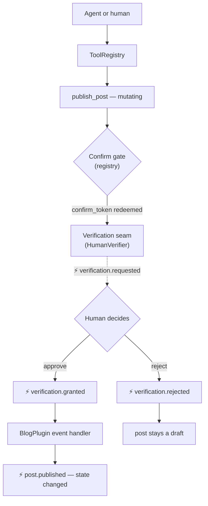

<p align="center">
  <a href="https://github.com/getmilpa">
    <picture>
      <source media="(prefers-color-scheme: dark)" srcset="https://raw.githubusercontent.com/getmilpa/core/main/art/lockup/milpa-lockup-v-color-dark.svg">
      
    </picture>
  </a>
</p>

# Milpa Example: Agent-Ready Blog

> The Milpa loop, live: `plugin → capability → tool → verification → event → result` —
> as a tiny agent-ready blog you can run in two commands.

[](https://github.com/getmilpa/example-agent-ready-blog/actions/workflows/ci.yml)
[](https://packagist.org/packages/milpa/example-agent-ready-blog)
[](https://www.php.net/)
[](LICENSE)

**This repo doesn't teach you how to build a blog. It teaches you how to make a mutation
agent-ready without losing human control.**

Most examples let agents mutate state directly. This one does not. Every mutation enters
through a declared tool, passes through a confirmation/verification seam, and only becomes
application state through an event. The blog is just the smallest honest thing worth mutating.


```mermaid
flowchart TD
    A["Agent or human"] --> B["ToolRegistry"]
    B --> C["publish_post — mutating"]
    C --> D{"Confirm gate<br/>(registry)"}
    D -->|"confirm_token redeemed"| E["Verification seam<br/>(HumanVerifier)"]
    E -.->|"⚡ verification.requested"| F{"Human decides"}
    F -->|approve| G["⚡ verification.granted"]
    F -->|reject| H["⚡ verification.rejected"]
    G --> I["BlogPlugin event handler"]
    I --> J["⚡ post.published — state changed"]
    H --> K["post stays a draft"]
```

Prefer a guided tour? Read [`docs/walkthrough.md`](docs/walkthrough.md) — fourteen stops, in
the order that makes both loops click: first how a mutation is gated, then who is allowed to
answer the gate.

## Quickstart

```bash
composer create-project milpa/example-agent-ready-blog blog
cd blog
php bin/blog.php
```

You'll be asked to approve or reject a publish request interactively. Here's a real run
(`a` typed at the prompt):

```
milpa · example-agent-ready-blog — the loop, live
plugin → capability → tool → verification → event → result

✔ Capability graph: StoragePlugin provides PostStorage → BlogPlugin requires it
✔ 3 plugins booted · tools: create_post, list_posts, process_instantiate, process_list_pending_approvals, process_submit_decision, publish_post, request_verification, resolve_verification

→ create_post("Hello Milpa") … draft #1 created (not mutating-gated: no friction)
→ publish_post(#1) … DENIED: 'publish_post' needs explicit consent and channel 'cli' takes consent as a signature naming this call — none was presented.
  el canal cli no acepta un «sí» genérico — pide una firma que nombre ESTA llamada
→ se presenta una firma DE UTILERÍA · 9A2C41F0… (demo@milpa.lat) — armada a mano, sin llave detrás
  este bucle enseña la FORMA del consentimiento; una firma de verdad decide en: php bin/process.php
  ⚡ verification.requested
→ autorizado por la firma … la herramienta corrió y preguntó al seam de VERIFICACIÓN (status: pending_verification)
? An agent wants to publish post #1 — [a]pprove / [r]eject: a
  ⚡ verification.granted
  ⚡ post.published (id 1)
✔ post #1 is now PUBLISHED — the result arrived via event, handled by BlogPlugin

See it: php -S localhost:8080 -t public   →   http://localhost:8080
```

**Read that run for its shape, not for its identities.** A terminal is `local-shell` to the
runtime — nobody verified who is typing — so `publish_post` is refused until a signature names the
call. This first loop then presents a *stand-in* signer, built by hand so the two-command
quickstart needs no key, and says so on screen: nothing was verified there. The
[process loop](#the-process-loop--the-agent-proposes-a-person-disposes) is where this example does
it for real — a key, a signature over one decision, checked by the framework, in a session that is
not the agent's.

Now look at it:

```bash
php -S localhost:8080 -t public
```

Prefer non-interactive? `php bin/blog.php --auto-approve` and `php bin/blog.php --reject`
drive both paths without a prompt — that's exactly what this repo's own CI runs as its
smoke test.

## The loop, stage by stage

Every stage below is a real contract from a published package, not an abstraction invented
for this example.

| Stage | What runs | Published contract |
|---|---|---|
| **plugin** | `Kernel::boot()` instantiates `StoragePlugin`, `BlogPlugin`, `AgentToolsPlugin` | `Milpa\Interfaces\Plugin\PluginInterface` + `#[Milpa\Attributes\PluginMetadata]` (`milpa/core`) |
| **capability** | `Kernel::boot()` gates the plugin graph through the architecture resolver *before* anything boots: plugins boot in the report's `loadOrder[]`, and a `requires` with no `provides` throws `ArchitectureBlockedException` with a learnable message | `#[Milpa\Attributes\PluginMetadata]` capability records (`milpa/core`) resolved by `milpa/resolver` via `milpa/runtime` |
| **tool** | `AgentToolsPlugin::registerTools()` scans `BlogTools`'s three `#[Tool]` methods into the registry | `Milpa\ToolRuntime\{Attributes\Tool,Attributes\Param,ToolScanner,ToolRegistry}` + `Milpa\Interfaces\Tooling\ToolProviderInterface` (`milpa/tool-runtime` on `milpa/core`) |
| **verification** | `publish_post` asks `HumanVerifier::verify()`; a human approves or rejects at the terminal prompt | `Milpa\Interfaces\Verification\VerifierInterface` (`milpa/core`) + `Milpa\ToolRuntime\Verification\HumanVerifier` (`milpa/tool-runtime`) |
| **event** | Every step above fires through one shared dispatcher — `verification.requested` / `verification.granted` / `verification.rejected` / `post.published` — printed live by name | `Milpa\Interfaces\Event\MilpaEventDispatcherInterface` (`milpa/core`), implemented by `milpa/events`' `EventDispatcher` |
| **result** | `BlogPlugin`'s `verification.granted` handler flips the post to `published` and dispatches `post.published` — the result arrives *via event*, not a return value | `src/Plugins/BlogPlugin/BlogPlugin.php` (this repo) |

## What an agent sees

The tools are transport-agnostic: what follows is the registry's own
`getToolSummaries()` output — the exact catalog an MCP host (or any other transport)
would list. This is real output, not documentation prose:

```json
[
  {
    "name": "publish_post",
    "description": "Publish a draft post (requires human verification)",
    "inputSchema": {
      "type": "object",
      "properties": { "id": { "type": "integer", "description": "Post id" } },
      "required": ["id"]
    }
  },
  {
    "name": "create_post",
    "description": "Create a draft post",
    "inputSchema": {
      "type": "object",
      "properties": {
        "title": { "type": "string", "description": "Post title" },
        "body":  { "type": "string", "description": "Post body" }
      },
      "required": ["title", "body"]
    }
  }
]
```

The full catalog has eight tools, in three categories:

| Category | Tools | Purpose |
|---|---|---|
| **Application** | `create_post`, `list_posts`, `publish_post` | the blog's own operations |
| **Runtime / control** | `request_verification`, `resolve_verification` | the verification seam |
| **Process** | `process_instantiate`, `process_list_pending_approvals`, `process_submit_decision` | the event-sourced process loop |

They are listed together because **MCP exposes tools, not architectural layers** — policy
decides which principals may call each one. (Run `$kernel->registry()->getToolSummaries()`
to see the whole list.) Being listed is not being allowed: an agent sees
`process_submit_decision` in its catalog and is refused when it calls it — that is the
[process loop](#the-process-loop--the-agent-proposes-a-person-disposes) below.

From the agent's side, over MCP, publishing is a two-call choreography — it never mutates on
the first try (on a terminal the `cli` channel asks for a signature instead, which is what the
Quickstart shows):

1. `publish_post(id: 1)` → the registry intercepts (the tool is `mutating`) and returns a
   `confirm_token` instead of running the tool.
2. `publish_post(id: 1, confirm_token: …)` → the tool runs, asks the verification seam,
   and returns `pending_verification` with a `request_id`.
3. The actual state change arrives **by event** (`verification.granted` →
   `post.published`), never as a return value the agent can force.

The two verification tools are split (`request_verification` opens, `resolve_verification`
closes) precisely so policy can treat them differently — the security boundary below spells
out what that means and what this demo deliberately leaves to you.

## The same tools, over MCP

`bin/mcp-server.php` puts this exact registry — the same eight tools, the same confirm-token
gate, the same verification seam — behind a standard MCP stdio transport (`milpa/mcp-server`:
JSON-RPC 2.0 over stdin/stdout, one message per line).

It is not a second API. It is the same core, wrapped: `Kernel::boot()` and the registry are
unchanged; only the outer loop differs (stdin/stdout instead of a terminal prompt).

Point an **MCP-compatible host that supports local stdio servers** at it — Claude Desktop,
Cursor, Windsurf and similar share this `mcpServers` config shape:

```json
{
  "mcpServers": {
    "agent-ready-blog": {
      "command": "php",
      "args": ["/absolute/path/to/blog/bin/mcp-server.php"]
    }
  }
}
```

Or run it directly to watch the wire, no host required:

```bash
php bin/mcp-server.php
```

STDOUT is protocol-only; human-readable status goes to STDERR (a stray `echo` on STDOUT
corrupts the wire). `notifications/initialized` gets no response line, per the JSON-RPC spec.

### A minimal session

```
→ {"jsonrpc":"2.0","id":1,"method":"initialize","params":{}}
← {"jsonrpc":"2.0","id":1,"result":{"protocolVersion":"2025-06-18",...}}
→ {"jsonrpc":"2.0","method":"notifications/initialized"}            (no response line)
→ {"jsonrpc":"2.0","id":2,"method":"tools/list"}
← {"jsonrpc":"2.0","id":2,"result":{"tools":[ ...8 tools... ]}}
→ tools/call create_post {"title":"Hello","body":"..."}             → draft #1
→ tools/call publish_post {"id":1}                                  → confirm_token (intercepted)
→ tools/call publish_post {"id":1,"confirm_token":"…"}              → pending_verification, request_id
→ tools/call resolve_verification {"request_id":"…","decision":"grant","principal":"…"}
←   verification.granted → post.published (the state change arrives by event)
```

### Two gates, different jobs

Publishing crosses **two** independent gates — a common point of confusion, so be explicit:

| Gate | Protects | Asks |
|---|---|---|
| **Confirm gate** (registry) | tool *execution* | "Are you sure this mutating tool should run at all?" |
| **Verification seam** (`HumanVerifier`) | domain *state transition* | "Should this change become real application state?" |

The confirm gate is generic registry-level safety; the verification seam is where policy,
human, or business approval lives. A mutating tool crosses both.

### ⚠️ Security boundary of this MCP example

**The tool loop demonstrates the verification *seam*, not an identity model — and that difference
is load-bearing.**

Over local stdio MCP the transport carries no authentication: whoever holds the pipe is `stdio`
(process-level trust). And `resolve_verification` takes the resolver's name **as an argument** —
`principal` — which as of `milpa/tool-runtime` 0.19 it still does. Put the two together and **an
agent can resolve its own verification by typing a human's name.** The last call of the minimal
session above does exactly that, and so does `tests/App/McpStdioTest.php`. It is not hidden here;
it is the edge of what this first loop shows, and a responsibility it leaves to the host.

Two things keep that boundary honest rather than hand-waved:

- **The seam to prevent self-approval already exists.** `request_verification` and
  `resolve_verification` are separate tools precisely so policy can restrict *who* may resolve
  — tool-runtime's `resolveScopes` gates it by authenticated principal. This demo doesn't wire
  an auth policy; production **must**.
- **The audit trail already records who resolved it.** Every call emits `tool.executed`
  carrying its `channel` and `principal` — so even under process-trust the resolver is logged,
  not anonymous.

In production, therefore:

```
resolve_verification MUST be restricted to an authenticated principal / scopes.
Over local stdio the host decides who calls it. Over HTTP, wire milpa/mcp-server's
Auth\TokenValidatorInterface (unused here) to authenticate the principal first.
```

The framework hands you the gate; **guarding it is explicitly your half of the contract.**

**The process loop below is where this example does guard it.** There the approver is never an
argument: it is whoever the house verified behind the call, and an MCP stdio caller is nobody in
particular.

## The process loop — the agent proposes, a person disposes

The tool loop above (`create_post` → confirm gate → verification → event) is one shape of control.
The `src/Orchestrator/` layer shows the next one: the same publish becomes a **process** that a post
walks through — `draft → review_gate[human] → published` — driven by three tools:

- `process_instantiate("publish_post", {post_id})` — starts the process; it auto-advances to the
  human gate and stops. Whoever called it is recorded as the gate's **requester**.
- `process_list_pending_approvals(assignee)` — the inbox; each pending decision carries a
  **decision artifact** (a `milpa/live` component whose options map 1:1 to the gate's transitions —
  what you can click is exactly what the process can do).
- `process_submit_decision(instance_id, gate_id, "grant"|"reject")` — answers the gate; `grant`
  advances to `published`, `reject` returns to `draft`. **It takes no `principal`.** Who answered is
  whoever the house verified behind the call — never a name the caller typed.

That last line is the whole lesson of this loop, so the demo is built around it: **two sessions,
two identities.**

```bash
php bin/process.php    # session 1 — the agent: drafts, starts the process, tries to approve itself
php bin/enroll.php     # once — you: make a demo identity and enroll it with the house
php bin/decide.php     # session 2 — you: read the gate, decide, sign the decision
```

The person's half needs `gpg` on the machine: a decision here is an OpenPGP signature.

### Session 1 — the agent proposes, and is refused at its own gate

```
milpa · example-agent-ready-blog — the PROCESS loop · session 1 of 2: the agent proposes
process_instantiate → [auto-advance] → review_gate ⏸   a person answers it:  php bin/decide.php

→ create_post("Hello Milpa Process") … draft post #1 created
→ process_instantiate(publish_post, {post_id: 1}) … instance 66bbe779-de67-40f0-8e06-34bb0b57b43f at review_gate
  requested by 'local-shell' — the name of this terminal, not of a person: nobody verified who is typing

The agent wants its work shipped, so it tries to answer its own gate:
→ process_submit_decision(grant) … REFUSED · UNVERIFIED_APPROVER
  A gate is answered by a verified actor — a signed call or a passkey session — and 'local-shell' names a transport, not a person.
→ process_submit_decision(grant, principal: "human:you") … REFUSED · UNVERIFIED_APPROVER
  naming a person is not being one: the approver is whoever the house verified, never an argument

✔ post #1 "Hello Milpa Process" is still a DRAFT and its gate is still open. The agent proposed; it does not dispose.
```

`local-shell` is the honest name for an unsigned terminal: a process that reached the machine, not
a person. Such a caller may **start** a process. It may not **answer** its gate — and claiming to
be somebody else no longer helps, because the tool stopped reading that argument
(`milpa/orchestrator` 0.11) and then stopped accepting a transport's name as an approver at all
(0.13).

Earlier versions of this demo did the opposite. One script instantiated the process and resolved
the gate in the same breath, passing `'principal' => 'human:you'` "so the demo never trips the
anti-self-approval invariant". That was the bypass, written down as a convenience — and the second
refusal above is that exact call, still being tried.

### Session 2 — a person decides, under their own signature

```
milpa · example-agent-ready-blog — the PROCESS loop · session 2 of 2: a person decides

You are BAE14C3392D0DD9BFCD6B4950B4F6CE302CD7FFE — a DEMO identity (see bin/enroll.php).

Waiting for you: instance 66bbe779-de67-40f0-8e06-34bb0b57b43f · gate review_gate_gate · requested by 'local-shell'
---
Hello Milpa Process

The publish_post process, demonstrated live: draft -> review_gate -> published.

[APPROVE] approve (grant)
[REJECT] reject (reject)
---

? Your decision — [g]rant / [r]eject: g

→ you sign exactly this call, and nothing wider:
  {"arguments":{"decision":"grant","gate_id":"review_gate_gate","instance_id":"66bbe779-de67-40f0-8e06-34bb0b57b43f"},"host":"yourhost:/path/to/blog/var/events.jsonl","issuedAt":"2026-10-06T04:48:45+00:00","nonce":"a5cfa512e795e9ca5b120301cbe508fb","operation":"process_submit_decision"}
→ the house checked it: an enrolled key signed it · it names this call · it is fresh · it was never used
  ✔ signed by BAE14C3392D0DD9BFCD6B4950B4F6CE302CD7FFE (Demo Editor (throwaway key) <editor@blog.invalid>)
→ process_submit_decision ran as that signer. On the log:
  ⚡ publish_post 66bbe779  grant — by BAE14C3392D0DD9BFCD6B4950B4F6CE302CD7FFE (Demo Editor (throwaway key) <editor@blog.invalid>)
  ⚡ publish_post 66bbe779  ProcessTerminalReached — published

✔ GRANT — instance 66bbe779-de67-40f0-8e06-34bb0b57b43f reached 'published'. Post #1 "Hello Milpa Process" is now PUBLISHED.
```

`php bin/decide.php --grant` and `--reject` skip the prompt — that is what the test suite and CI
run. At the prompt, anything that is not a grant is a reject: silence is not consent.

The same command answers a **nested** gate. `php bin/campaign.php` starts a `publish_campaign`
parent that runs `publish_post` as a subprocess; the agent is refused at the child's gate just the
same; and one signed `grant` publishes the post and lets the campaign run on to `done`:

```
  ⚡ publish_post 5768bd75  grant — by BAE14C3392D0DD9BFCD6B4950B4F6CE302CD7FFE (Demo Editor (throwaway key) <editor@blog.invalid>)
  ⚡ publish_post 5768bd75  ProcessTerminalReached — published
  ⚡ publish_campaign f5c93f87  published
  ⚡ publish_campaign f5c93f87  announce
  ⚡ publish_campaign f5c93f87  ProcessTerminalReached — done
```

### How the person is authenticated — and why that is legitimate

Nothing in `bin/decide.php` names an approver. The identity comes out of a signature, along the
path `milpa/tool-runtime` ships for exactly this:

1. **Enroll, once.** `bin/enroll.php` generates an OpenPGP key in the *editor's own* keyring —
   outside this project — and hands the house its **public half** (`var/identity/approvers/`). From
   then on the house can check that key's signature and can never produce one.
2. **Sign one call.** `bin/decide.php` asks the house for the exact bytes of this decision — an
   `OperationAuthorization`: operation, arguments, house, time, nonce — and the editor's key signs
   those bytes. Not "yes": *this* decision, on *this* gate.
3. **The house verifies.** `src/Identity/SignedCallDesk.php` hands the bytes and the signature to
   tool-runtime's `OperationAuthorizer`, with tool-runtime's `GnupgSignatureVerifier` held to the
   house's keyring. It grants only if an **enrolled** key signed it, it **names this call**, it is
   **fresh** (two minutes), and it is **unused**.
4. **Only then is there somebody.** The call runs under `ToolContext::authorizedBy($signer, …)`:
   the principal is the key's fingerprint, and that is what the log records as who decided.

That desk is the only place in the application where a verified identity is made — and it has
to be, because the engine takes the host's word here. It refuses the names a transport writes when
nobody was verified (`local-shell`, `stdio`, `mcp`) and treats any *other* principal the host hands
it as somebody the host checked; one `ToolContext::stdio($id, 'human:editor')` in a script would
make an MCP agent an approver. Never building such a context by hand is the host's half of the
contract, and `tests/Identity/OnlyTheDeskMakesSomebodyTest.php` holds this codebase to it.

Every way a signature could look acceptable and not be is tested with real keys and real
signatures (`tests/Identity/SignedCallDeskTest.php`):

| Presented at the desk | Answer |
|---|---|
| a valid signature from a key the house never enrolled | refused — *the signature does not verify, or its key is unknown* |
| a signature over `reject`, presented as `grant` | refused — *this authorization is for a different call* |
| a signature from ten minutes ago | refused — *the authorization expired* |
| the same signed decision, a second time | refused — *this authorization was already used* |
| a decision signed for another house | refused — *this authorization is for a different call* |
| an enrolled editor answering a gate they opened themselves | signature accepted; the gate answers `SELF_APPROVAL_FORBIDDEN` |

**What is a demo here, said plainly.** The *key* is: it has no passphrase, so signing asks nothing
of you, and it is generated on your machine when you run `bin/enroll.php` — never committed, not
even kept under the project. And the *custody* is: on one laptop the agent's process could read
that keyring, or run `bin/enroll.php` itself. With a real key the signature is the moment a person
is present — a passphrase typed, a card touched — and enrolling an approver is itself an act of
authority, the step you would guard hardest. What is **not** a demo is everything after the
signature: the same verifier, the same authorizer and the same context a real key goes through.

### Who can do what

| Caller | Who it is to the house | Start a process | Answer a gate |
|---|---|---|---|
| `bin/process.php`, `bin/campaign.php` | `local-shell` — an unsigned terminal | yes | no — `UNVERIFIED_APPROVER` |
| an MCP host on `bin/mcp-server.php` | `stdio` — whoever holds the pipe | yes | no — `UNVERIFIED_APPROVER` |
| a signed call (`bin/decide.php`) | the fingerprint of an enrolled key | yes | yes — unless it opened that gate itself: `SELF_APPROVAL_FORBIDDEN` |
| a call with no context at all | nobody | no — `UNAUTHENTICATED` | no — `UNAUTHENTICATED` |

`tests/App/McpProcessToolsTest.php` runs the second and third rows as two real processes: an agent
on the MCP pipe that proposes and is refused, and `bin/decide.php` as a session of its own whose
decision the agent's still-open pipe then sees.

### State is never stored, only derived

The other load-bearing property of this loop: every step is an append-only event in
`var/events.jsonl`, and the current state is a *projection* of that log. A brand-new store over the
same file reconstructs `published` independently — which is what makes the whole history auditable
and replayable (time-travel for free). It is also the record of who did what, and it keeps the two
kinds of caller apart — a gate opened by a transport's name, answered by a key's fingerprint:

```json
{"type":"GateOpened","payload":{"gate_id":"review_gate_gate","requester":"local-shell","options":["grant","reject"]}}
{"type":"grant","payload":{"by":"BAE14C3392D0DD9BFCD6B4950B4F6CE302CD7FFE (Demo Editor (throwaway key) <editor@blog.invalid>)"}}
```

The generic engine is `milpa/orchestrator` (the process definition, reducer, auto-advancing runner,
and human gate) over `milpa/event-store` (the append-only log) — this example only `require`s them
and supplies the **domain**: the `publish_post` definition, a decision surface that renders a post,
and a `process.terminal` listener that publishes it. This layer *was* the greenhouse those two
packages were extracted from; re-pointing it onto them — and watching this same loop stay green —
is the dogfood that proves the extraction.

## What implements what

Earlier versions of this repo implemented every framework seam inline (~440 lines: a container,
an event dispatcher, a capability graph, a router). Those are gone — since v0.6.0 the app boots on
**`milpa/runtime`**, which composes the published family (container + events + core's capability
check + http routing) into one `Kernel::boot()`. What was a hand-rolled kernel is now a ~40-line
bootstrap. The framework seams live in the packages where they belong; this repo implements only
the *domain* on top of them:

| Layer | What this repo implements | On top of |
|---|---|---|
| Boot | A thin bootstrap + a config-driven plugin list | `milpa/runtime` (`Kernel::boot`) |
| Domain | The blog plugins (Storage / Blog / AgentTools) + the 5 blog/verification tools | `milpa/core` contracts + `milpa/tool-runtime` |
| Transport | `bin/mcp-server.php` wraps the same registry over stdio | `milpa/mcp-server` |
| Process | The `publish_post` domain (`src/Orchestrator/`) — definition, decision surface, terminal listener | `milpa/orchestrator` + `milpa/event-store` (engine) over `milpa/workflow` + `milpa/live` + `milpa/events` |
| Identity | Who may answer a gate (`src/Identity/`) — enrolling a person's public key, and the desk that turns a signed call into a verified context | `milpa/tool-runtime`'s `Identity\*` (`OperationAuthorizer`, `GnupgSignatureVerifier`) + `ToolContext::authorizedBy()`, over the `gpg` on the machine |

The reduction is the point: the inline kernel retired with its tests green (they moved upstream into
the packages that now own that behavior). Read the ~40-line bootstrap and the domain — the framework
is no longer something you re-read here, it's something you `require`.

## The storage backend is one config line

Since `milpa/data` 0.2, `StoragePlugin` names **no backend**. It hands the app's `storage`
config block to `RepositoryFactory::fromConfig()` and registers whatever comes back behind the
same `RepositoryInterface` capability `BlogPlugin` requires. The block lives in
`Kernel::boot()`:

```php
$storage = [
    'driver' => 'sqlite',   // ⇄ 'file' ⇄ 'mysql' ⇄ 'memory' — the whole migration is this line
    'path' => $storageFile ?? $root . '/var/blog.db',
];
```

This example shipped on `'file'` (the whole collection in one JSON file, `var/posts.json`)
until 0.2 landed; today it ships on `'sqlite'` (a real database in one file, `var/blog.db`).
The switch touched zero plugin, tool, or test code — the same suite and the same
`php bin/blog.php --auto-approve` loop prove both backends. Flip the driver back and they
still do.

## What this example is NOT

- **Not production.** Storage is a single-file SQLite database (`var/blog.db`); the only
  identity is a demo key with no passphrase, living on the same machine as the agent; and the DI
  container (`milpa/container`, via `milpa/runtime`) does no compiled/cached resolution here.
- **Not a template to fork for a real blog.** It's a template for understanding the loop.
- **Mutations enter via tools, not HTTP** — that's the point. The web view
  (`php -S localhost:8080 -t public`) is read-only by design: publishing a post always goes
  through `create_post` → `publish_post` → human verification, whether the caller is a human
  running `bin/blog.php` or an agent calling the same tools over MCP (`bin/mcp-server.php`) —
  the tools are transport-agnostic, and both entry points prove it.

## The family

This example consumes the published Milpa family, unmodified, from Packagist — riding the
current tree (`milpa/core ^0.12`, `milpa/runtime ^0.17`, `milpa/tool-runtime ^0.19`,
`milpa/orchestrator ^0.13`; `milpa/resolver` and `milpa/command` arrive transitively). The
load-bearing packages:

- [`milpa/core`](https://packagist.org/packages/milpa/core) — the contracts core ·
  [API reference](https://getmilpa.github.io/core/)
- [`milpa/runtime`](https://packagist.org/packages/milpa/runtime) — the bootable kernel
  (`Kernel::boot()`, the resolver gate) · [API reference](https://getmilpa.github.io/runtime/)
- [`milpa/http`](https://packagist.org/packages/milpa/http) — PSR-15-native routing
  contracts · [API reference](https://getmilpa.github.io/http/)
- [`milpa/tool-runtime`](https://packagist.org/packages/milpa/tool-runtime) — the
  agent-tool-execution engine, and the signed-call authorizer a person's decision goes through ·
  [API reference](https://getmilpa.github.io/tool-runtime/)
- [`milpa/mcp-server`](https://packagist.org/packages/milpa/mcp-server) — the MCP
  transport core (JSON-RPC 2.0 over the tool registry) · [API reference](https://getmilpa.github.io/mcp-server/)
- [`milpa/orchestrator`](https://packagist.org/packages/milpa/orchestrator) — the
  event-sourced process engine whose gates only a verified actor answers, over
  [`milpa/event-store`](https://packagist.org/packages/milpa/event-store),
  [`milpa/workflow`](https://packagist.org/packages/milpa/workflow) and
  [`milpa/live`](https://packagist.org/packages/milpa/live)
- [`milpa/data`](https://packagist.org/packages/milpa/data) — runtime-native persistence
  (`EntityInterface` + `RepositoryFactory` over the file / sqlite / mysql / memory backends)

## Contributing

Contributions are welcome — see [CONTRIBUTING.md](CONTRIBUTING.md). Please report security
issues via [SECURITY.md](SECURITY.md), and note that this project follows a
[Code of Conduct](CODE_OF_CONDUCT.md).

## License

[Apache-2.0](LICENSE) © Rodrigo Vicente - TeamX Agency.

---

Milpa is designed, built, and maintained by **[Rodrigo Vicente - TeamX Agency](https://teamx.agency/?utm_source=github&utm_medium=readme&utm_campaign=milpa&utm_content=example-agent-ready-blog)**.
